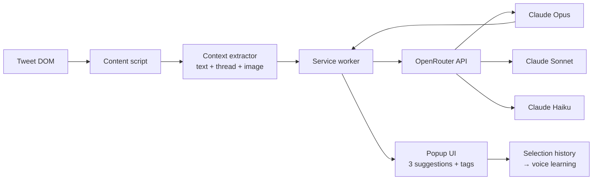

# Tweet Bot

AI-powered Chrome extension that generates tweet replies, quote tweets, and threads using Claude via OpenRouter. Rhetorical-strategy tagged suggestions, image understanding, voice learning, real-time streaming.

- **Portfolio:** https://arjun-varma.com/

## Problem

Social media engagement on X/Twitter requires quick, thoughtful responses that maintain your authentic voice. Crafting the right reply, quote tweet, or thread takes time and mental energy — especially when you want to contribute meaningfully at scale.

Goal: an AI assistant that integrates directly into the Twitter experience and provides context-aware suggestions that match your personal style.

## Challenge

- Twitter/X's DOM structure is complex and frequently changes, making reliable element detection hard
- Extracting full context (tweet text, author, thread history, images) requires sophisticated DOM traversal
- Suggestions must feel authentic and match the user's voice, not generic AI output
- Streaming responses must be smooth and non-disruptive
- Chrome Extension Manifest V3 restrictions limit background processing capabilities

## Approach

1. **DOM injection** — content scripts inject AI buttons directly into every tweet's action bar, blending with native UI
2. **Context extraction** — sophisticated tweet parser captures text, author, thread context, and image content for multimodal understanding
3. **Voice learning** — tracks which suggestions the user selects over time and adapts future prompts to match their style
4. **Multi-model support** — integration with Claude Opus / Sonnet / Haiku via OpenRouter for different quality/speed tradeoffs

## Solution / Architecture



**Components:**

- **Service worker backend** — API calls, streaming, prompt building, selection history tracking
- **Content scripts** — DOM injection, tweet extraction, popup UI rendering
- **Tone control system** — five rhetorical modes (witty, professional, casual, provocative, informative) with tagged strategy labels like `[contrarian take]`, `[empathy hook]`
- **Thread mode** — generate coherent multi-tweet threads on any topic
- **Settings dashboard** — model selection, usage tracking with cost estimates, export/import

Each suggestion comes with a rhetorical strategy tag so users understand the angle.

## Impact / Results

- 3 distinct suggestions per request, each with a different rhetorical angle
- Supports replies, quote tweets, original tweets, and multi-tweet threads
- Image understanding for context-aware responses to visual content
- Voice learning system improves suggestions over time
- Real-time streaming for instant feedback
- **Full privacy** — API key and history stored locally, no external data collection

## Tech Stack

JavaScript · Chrome Extension MV3 · OpenRouter API · Claude Opus / Sonnet / Haiku · CSS

## Run Locally / Load Unpacked

```bash
git clone https://github.com/ARJUNVARMA2000/tweet-bot.git
```

1. Open `chrome://extensions`, enable **Developer mode**
2. **Load unpacked** → select the cloned directory
3. Open the extension options page and paste your OpenRouter API key
4. Visit x.com and look for the new action in each tweet's bar

## License

MIT
